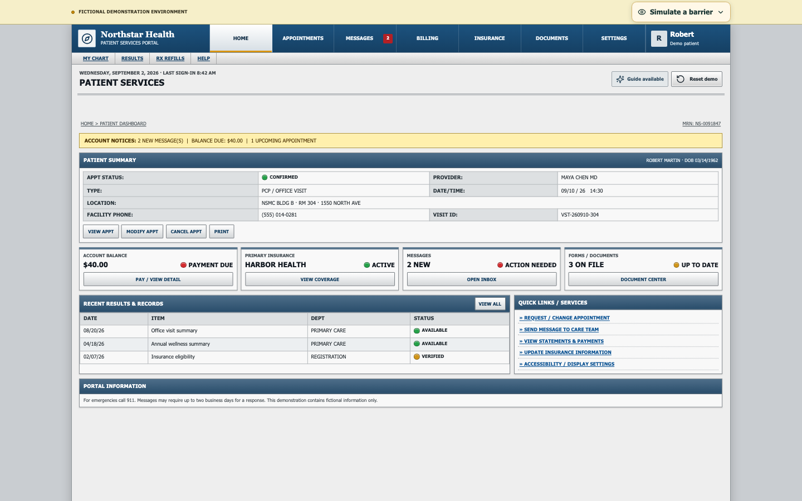
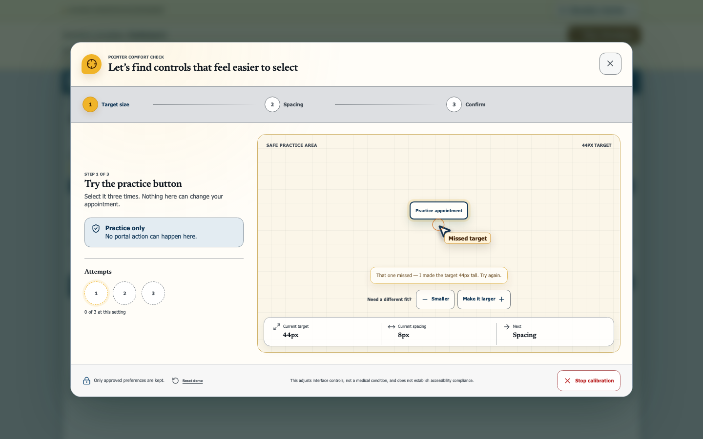

# Guide

**What if a website could learn how you use it—without diagnosing you—and compose a more comfortable interface with you?**

Guide is a WebMCP-native interaction layer inside Northstar Health, a fictional patient-services portal. A person can describe a functional barrier to ChatGPT, safely calibrate one interaction dimension on the webpage, approve the result, and continue the real task in an interface composed from those preferences.

Guide and WebMCP are the product. The built-in barrier simulator is an illustrative demonstration aid.

> Agents should not just use the web for us. They should be able to use it with us.

| Fixed baseline | Closed-loop personalization |
|---|---|
|  |  |

## Live Demo

- Production: [https://guide-webmcp.vercel.app](https://guide-webmcp.vercel.app)
- Source: [github.com/ikTheProgrammer1/guide-showcase](https://github.com/ikTheProgrammer1/guide-showcase)

Everything in Northstar is fictional. There is no healthcare connection, authentication, upload, payment processing, medical advice, or financial advice.

## The Central Experience

Northstar starts as a dense but functional institutional portal. It does not have a second “accessible template.” Every view uses one semantic React component tree.

For the hero flow:

1. The person activates the illustrative Parkinson’s pointer-precision simulator and genuinely misses the compact appointment control.
2. They say: “My hand shakes and I keep missing buttons. Help me use this page.”
3. ChatGPT selects `start_interface_calibration({ domain: "pointer_precision", goal: "reschedule_appointment" })` once.
4. Northstar immediately opens a safe, non-operational practice target.
5. Practice attempts stay local. Northstar adjusts one measured variable at a time: target size first, then control spacing.
6. After several successful attempts, the person can request larger, smaller, closer, or farther-apart controls.
7. Nothing is applied until the person explicitly says the result feels comfortable.
8. Northstar stores only the approved functional profile and composes compatible semantic regions independently.
9. The rescheduling chooser opens locally with no selected time. The person chooses a slot.
10. Guide may confirm only after explicit delegation and a fresh appointment, slot, and revision check.
11. The person can undo the change.

The webpage never maps a diagnosis such as “Parkinson’s” to a disability template. Diagnosis words are neither calibration inputs nor saved profile fields. A vague functional statement routes to calibration; an explicit request such as “make text 175%” remains a direct `configure_accessibility` request.

## Safe, Bounded Composition

Northstar resolves an adaptation manifest for six semantic component regions:

- `primary_navigation`
- `appointment_summary`
- `appointment_actions`
- `status_indicators`
- `forms`
- `secondary_content`

Each region declares its own supported subset of bounded properties: target size, spacing, row/column/step-by-step layout, information priority, secondary-content visibility, label style, status representation, focus visibility, review protection, and destructive-action placement.

The profile is projected only into compatible regions. Human changes from the single **Personalize interface** control are sanitized and applied last, so they outrank composed defaults. WebMCP exposes none of the following:

- arbitrary CSS or selectors;
- HTML generation;
- screen or DOM coordinates;
- unrestricted DOM manipulation;
- raw pointer telemetry.

Destructive actions remain separate after calibration, consequential changes retain an explicit review, and appointment confirmation is never automatic.

## Pointer-Precision Calibration

Pointer precision is the one complete P0 calibration. The registry contains typed extension points for visual, color, language, attention, and keyboard calibration families, but those are intentionally not exposed until they can be demonstrated honestly.

The practice button cannot navigate, modify an appointment, or change account data. Pointer events are immediately reduced to non-identifying aggregates:

- attempt and success counts;
- miss count and total approximate miss distance;
- correction count;
- pointer versus keyboard activation counts.

Raw coordinates are used transiently for hit testing and are never retained. Aggregate practice data is discarded after approval or cancellation. The approved profile contains only a preferred input method, minimum target size, minimum control gap, review protection, focus visibility, and focused-density preference.

Calibration is session-only by default. **Remember these preferences on Northstar** is an explicit opt-in to versioned local storage. Only the approved profile and bounded human region overrides are stored; Reset Demo clears them.

## WebMCP Tools

Guide uses the secure-context imperative API, `document.modelContext.registerTool()`. The AI client supplies language understanding; the website owns semantics, calibration, state, rendering, and visible presence.

| Tool | Lifecycle | Behavior |
|---|---|---|
| `get_portal_state` | Always | Reads the visible portal, revisions, pending action, human overrides, and approved component personalization. Calibration attempts and simulator state are excluded. |
| `configure_accessibility` | Always | Applies explicit text, contrast, density, control, spacing, status, emphasis, and optional read-aloud settings. |
| `start_interface_calibration` | Always | Opens bounded pointer-precision calibration and returns immediately; all practice continues locally. |
| `guide_to` | Always | Points, highlights, and explains a semantic target without activating it. |
| `open_section` | Always | Opens one of seven portal sections. |
| `get_upcoming_appointments` | Always | Reads the fictional appointment. |
| `get_reschedule_options` | Always | Reads the three fictional alternative times without opening a workflow. |
| `open_reschedule` | Always | Opens the non-committing chooser. |
| `select_reschedule_slot` | Always | Selects a visible slot but never commits it. |
| `get_bill_details` | Always | Returns the controlled fictional $160 / $120 / $40 breakdown. |
| `get_insurance_status` | Always | Returns the controlled fictional active policy. |
| `confirm_reschedule` | Valid reviewed slot only | Revalidates and commits after delegation, then unregisters immediately. |

`guide_to.message` is length-bounded and rendered only as React text. All tool schemas use closed JSON objects and enums. `untrustedContentHint: false` is used only for controlled fictional constants and normalized store values.

The existing revision safety model remains intact:

- `uiRevision` repositions Guide after visible structure or geometry changes;
- `navigationRevision` detects a changed section;
- `rescheduleRevision` protects the current workflow and selected time;
- `manifestRevision` tracks approved profiles and bounded region overrides.

Guide never calls `.focus()` while pointing. Dialog focus changes are intentional and local to the modal workflow. A stale confirmation returns `selection_changed` rather than overwriting a person’s latest choice.

## Integrated Barrier Demonstration

The human-controlled **Simulate a barrier** panel is separate from the portal, calibration, approved profile, and WebMCP state.

Its Parkinson’s option applies deterministic pointer displacement only to fine mouse/trackpad input. The generic hit test compares the actionable element actually under each coordinate:

```ts
const physicalControl = document.elementFromPoint(x, y)?.closest(actionableSelector);
const simulatedControl = document.elementFromPoint(simulatedX, simulatedY)?.closest(actionableSelector);
```

Activation is allowed only when both resolve to the same element. There is no nearest-control search, click redirection, replacement click, or appointment-specific failure branch. Keyboard, touch, WebMCP, and programmatic actions remain unaffected. The same algorithm applies to the safe practice target, so the simulator can naturally influence the demonstration without calibration reading simulator state.

Color-difference effects use fixed matrices from the published [Machado color-vision model](https://profs.ic.uff.br/~laffernandes/content/publications/journal/2009_tvcg_15%286%29/machado_oliveira_fernandes-tvcg-15%286%29-2009-corrected.pdf). Dyslexia and Concentration difficulty stay visibly labeled **Illustrative** and are not part of the hero story.

These effects approximate isolated interaction barriers only. They do not reproduce anyone’s disability, diagnose a condition, replace testing with disabled people, or establish accessibility compliance.

## Architecture

```text
Person speaks or types a functional need
                  │
                  ▼
ChatGPT discovers bounded WebMCP tools
                  │
                  ├── explicit setting ──► configure_accessibility
                  │
                  └── vague barrier ─────► start_interface_calibration
                                             │ returns immediately
                                             ▼
                                      local safe practice loop
                                             │ human approval
                                             ▼
                            approved functional profile (no diagnosis)
                                             │
                                             ▼
                         bounded per-region adaptation manifest
                                             │
              human overrides ──────────────┘ applied last
                                             ▼
                           one semantic React component tree

Separate simulation store ── human-only illustrative effects
  never read by calibration, portal state, or WebMCP
```

- `src/adaptation/` — capabilities, manifest resolver, profile types, and opt-in persistence
- `src/calibration/` — typed registry, aggregate-only engine, session store, and startup controller
- `src/webmcp/` — closed schemas, handlers, annotations, and dynamic registration
- `src/presence/` — serialized pointing, semantic targets, cancellation, and bounded speech
- `src/state/` — portal state, revisions, attribution, confirmation, Undo, and reset
- `src/simulation/` — isolated simulator, reversible effects, and target-agnostic DOM hit testing

## Local Development

Requires Node.js 22+ and npm 11+.

```bash
npm install
npm run dev
```

Open `http://127.0.0.1:5173`. Direct paths such as `/appointments` load through the SPA fallback. Browsers without WebMCP retain the fully functional manual portal and show an honest compatibility notice.

Guide tools require a supported ChatGPT desktop account and model using the built-in browser, or a WebMCP-enabled Chrome environment. For local Chrome testing, enable:

```text
chrome://flags/#enable-webmcp-testing
```

Availability depends on the current account, selected model, page, permissions, and enabled Site Tools.

## Verification

```bash
npm run check
npm run test:e2e
npm run screenshots
git diff --check
```

Vitest and React Testing Library cover manifest capability boundaries, profile composition, human override precedence, aggregate-only calibration, one-variable-at-a-time adjustment, opt-in persistence, reset, attribution, stale actions, Undo, tool schemas, and simulator isolation.

Playwright runs against desktop and 375 px layouts with an injected imperative WebMCP implementation. It covers all tool lifecycles, the full hero flow, real hit testing, local calibration, dynamic confirmation removal, keyboard operation, reduced motion, 200% text, speech outcomes, focus safety, direct routes, and axe scans.

See [Accessibility QA](./docs/accessibility-qa.md) and [Natural-language tool-selection evaluations](./docs/tool-selection-evals.md). Automated and manual results are implementation evidence, not an accessibility certification.

## Suggested Live Scenario

1. Reset Northstar and activate **Simulate a barrier → Mobility → Parkinson’s**.
2. Show a genuine miss on compact **MODIFY APPT**.
3. Ask: “My hand shakes and I keep missing buttons. Help me use this page.”
4. Confirm ChatGPT calls `start_interface_calibration` once.
5. Complete the local practice loop and explicitly approve the result.
6. Keep the simulator active while Northstar opens the composed rescheduling chooser.
7. Select **September 14 at 3:00 PM** manually.
8. Ask: “That works. Finish it.”
9. Let Guide revalidate and confirm, then demonstrate **Undo change**.
10. Stop the simulation.

See [DEMO_SCRIPT.md](./DEMO_SCRIPT.md) for the sub-three-minute narration and shot list.

## Privacy and License

Northstar is frontend-only. Portal data, simulator state, and practice aggregates are session-only. The sole persistence path is the person’s explicit **Remember these preferences on Northstar** choice, which writes only the approved versioned functional profile and bounded region overrides to local storage. Reset Demo removes it.

[MIT](./LICENSE) © 2026 Nicolas Matta
