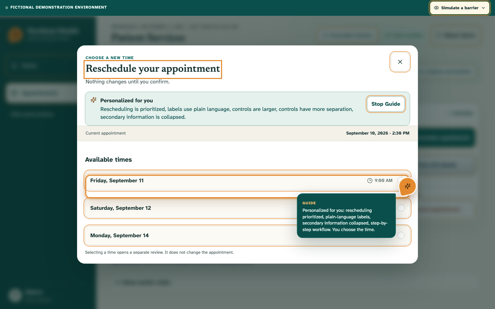

# Guide

**Describe what you need → the website reshapes itself → complete the task with your agent.**

Guide is a WebMCP-native experience inside Northstar Health, a fictional patient-services portal. It demonstrates a website that can become the right interface for a particular person instead of forcing everyone through the same fixed design.

The person uses their preferred client agent. Northstar exposes its real goals, workflow state, adaptation options, prerequisites, decisions, and consequences. The agent requests a bounded website-authored experience, and the same semantic React interface reorganizes immediately around the person and task.

> The agent does not merely operate the website. It helps the website become the interface this particular person needs, then uses that interface with them.

| Dense starting portal | Immediate task personalization | Optional fine-tuning |
|---|---|---|
|  |  |  |

## Live Demo

- Production: [https://guide-webmcp.vercel.app](https://guide-webmcp.vercel.app)
- Source: [github.com/ikTheProgrammer1/guide-showcase](https://github.com/ikTheProgrammer1/guide-showcase)

Everything in Northstar is fictional. There is no healthcare connection, authentication, upload, payment processing, medical advice, or financial advice.

## Primary Experience

A fresh visitor sees a plausible, dense 2008–2015 patient portal: compact controls, administrative language, competing navigation, and equally prominent information. The personalized experience is the result, never the default.

The hero prompt is:

> I don’t understand this portal. I need to change my appointment. Show me only what matters, use simple language, and help me—but let me choose the time.

The client agent can first read `get_northstar_context`, which describes supported goals, full workflows, current and future availability, blocked steps, human decisions, consequences, adaptation options, and safety rules. It then calls `personalize_for_task` once.

Northstar synchronously begins the visible transformation before Guide animation or speech:

- appointment rescheduling becomes the active goal;
- unrelated navigation remains discoverable under progressive disclosure;
- the appointment and safe next step become prominent;
- labels use plain language;
- controls become larger, separated, and easier to identify;
- destructive actions stay separate;
- secondary information collapses but remains available;
- the non-committing chooser opens with no selected time;
- a short page explanation states what changed.

The person selects a time manually. Only after they say “That works. Finish it” may Guide re-read the shared state, preview the old and new times, and invoke the dynamically available confirmation. The person can go Back or Undo.

A second request such as “Show everything on one page” reuses the same tool and the same components. It changes the bounded task manifest without discarding the current human selection.

## Moldable, Website-Owned Composition

Northstar resolves one semantic tree from 4 layers:

```text
Northstar defaults
  → approved functional preferences
  → temporary task experience
  → component-specific human overrides
```

Six semantic regions declare their own capabilities:

- `primary_navigation`
- `appointment_summary`
- `appointment_actions`
- `status_indicators`
- `forms`
- `secondary_content`

Bounded properties include target size, spacing, row/column/step-by-step layout, region placement, information priority, disclosure, label style, status representation, focus visibility, review protection, and destructive-action separation. The manual **Personalize interface** editor uses the same manifest and remains available without AI.

WebMCP never accepts arbitrary CSS, selectors, HTML, coordinates, scripts, generated controls, or unrestricted DOM manipulation. Personalization can reorganize presentation, but it cannot add capabilities, change data or permissions, remove required warnings, bypass human decisions, or weaken confirmation rules.

## Assistance & Authority

Northstar describes 5 assistance levels to compatible agents:

- **Show** identifies a relevant place without activation.
- **Explain** describes what a control does and what would happen.
- **Guide** focuses the interface and presents the next safe step.
- **Collaborate** prepares the workflow, shares turns, and pauses for human decisions.
- **Act** performs explicitly authorized actions after review and fresh validation.

Making a page easier never grants permission for a consequential action. When `timeSelection: "person"`, the agent-side slot-selection tool returns `human_decision_required`; manual selection remains available. Human overrides are recorded and outrank earlier agent choices. Confirmation captures the appointment, slot, and `rescheduleRevision`, then revalidates all 3 immediately before committing.

## WebMCP Surface

Guide uses the secure-context imperative API, `document.modelContext.registerTool()`.

| Tool | Lifecycle | Behavior |
|---|---|---|
| `get_portal_state` | Always | Reads visible state, revisions, task experience, pending action, and human overrides. Simulator and calibration attempts are excluded. |
| `get_northstar_context` | Always | Reads supported goals, end-to-end workflows, availability, prerequisites, human decisions, consequences, adaptations, and safety rules. |
| `personalize_for_task` | Always | Immediately composes one bounded task experience; may open a non-committing workflow, never selects or confirms. Reused for refinements. |
| `configure_accessibility` | Always | Applies explicit settings such as 175% text or stronger contrast while preserving omitted settings. |
| `start_interface_calibration` | Always | Opens optional local pointer-precision fine-tuning and returns immediately. |
| `guide_to` | Always | Points and explains without activation or focus movement. |
| `open_section` | Always | Opens 1 of 7 portal sections. |
| `get_upcoming_appointments` | Always | Reads the fictional appointment. |
| `get_reschedule_options` | Always | Reads the 3 alternative times without opening or changing the workflow. |
| `open_reschedule` | Always | Opens the existing non-committing chooser when no structural personalization was requested. |
| `select_reschedule_slot` | Always | Prepares a visible slot for review unless the current task reserves the choice for the person. Never commits. |
| `get_bill_details` | Always | Reads the controlled fictional $160 / $120 / $40 breakdown. |
| `get_insurance_status` | Always | Reads the controlled fictional policy status. |
| `confirm_reschedule` | Valid reviewed slot only | Revalidates and commits after explicit delegation, then unregisters immediately. |

All schemas are closed and bounded. `untrustedContentHint: false` is limited to controlled fictional constants and normalized application values. Tool handlers tolerate clients that omit execution options while preserving cancellation whenever an `AbortSignal` exists.

## Optional Fine-Tuning

Calibration is a refinement, not a gate. It may be offered when the first adaptation is insufficient, the person repeatedly misses controls, they do not know what size or spacing works, or they explicitly ask to fine-tune.

Pointer precision is the 1 complete calibration. The safe **Practice appointment** button cannot navigate or change data. Pointer events are reduced immediately to non-identifying aggregates; raw coordinates, individual misses, diagnoses, simulator labels, and calibration history are never stored. Northstar adjusts target size, then spacing, and applies a functional profile only after several successful attempts plus explicit comfort approval.

Preferences remain temporary by default. **Remember these preferences on Northstar** stores only the approved versioned functional profile and bounded component overrides. Temporary task context is never persisted. **Reset demo** clears remembered preferences, task context, calibration, simulation, appointment changes, and activity history.

## Simulator Boundary

The human-controlled barrier simulator is a separate demonstration aid. It is excluded from WebMCP context, portal state, task composition, profiles, and AI reasoning.

Its Parkinson’s option illustrates pointer displacement by comparing the actionable elements actually under physical and displaced coordinates with `document.elementFromPoint(...).closest(...)`. There is no nearest-control search, retargeting, replacement click, or appointment-specific failure. Keyboard, touch, WebMCP, and programmatic actions remain unaffected.

The simulator does not reproduce anyone’s disability, diagnose a condition, replace testing with disabled people, or establish accessibility compliance.

## Architecture

```text
Person describes goal + difficulty + presentation + desired help
                              │
                              ▼
             client discovers Northstar context and tools
                              │
             one bounded personalize_for_task request
                              │
                synchronous website-owned composition
                              │
                              ▼
                 one live semantic React interface
                              │
              human choice ↔ Guide collaboration
                              │
             fresh validation → confirmation → Undo

Optional calibration ── local aggregate-only refinement
Separate simulator ──── human-only illustrative effects
```

- `src/adaptation/` — capability registry, task resolver, manifest, and opt-in persistence
- `src/webmcp/` — closed schemas, current workflow context, handlers, and lifecycle registration
- `src/state/` — shared portal state, task experience, revision safety, attribution, Undo, and Reset
- `src/presence/` — serialized semantic pointing, cancellation, and bounded speech
- `src/calibration/` — optional local aggregate-only pointer fine-tuning
- `src/simulation/` — isolated effects and target-agnostic hit testing

## Local Development & Verification

Requires Node.js 22+ and npm 11+.

```bash
npm install
npm run dev
npm run check
npm run test:e2e
npm run screenshots
git diff --check
```

Direct routes such as `/appointments` use the SPA fallback. Browsers without WebMCP retain the fully functional manual portal and show an honest notice.

Guide tools require a supported ChatGPT desktop account and model using the built-in browser, or a WebMCP-enabled Chrome environment. For local Chrome testing, enable `chrome://flags/#enable-webmcp-testing`. Availability depends on the account, selected model, page, permissions, and enabled Site Tools.

Vitest and React Testing Library cover manifest boundaries, task composition, region placement, human precedence, persistence, reset, calibration privacy, stale actions, Undo, tool contracts, and simulator isolation. Playwright covers the one-call hero, one-page refinement, dynamic confirmation, desktop/mobile layouts, keyboard behavior, reduced motion, 200% text, focus safety, speech outcomes, real hit testing, direct routes, and axe scans.

See [Accessibility QA](./docs/accessibility-qa.md), [Site Tools evaluations](./docs/tool-selection-evals.md), and the [sub-three-minute demo script](./DEMO_SCRIPT.md). Automated and manual evidence is not accessibility certification.

## Privacy & License

Northstar is frontend-only. Portal state, temporary task context, simulator state, and calibration aggregates are session-only. The sole persistence path requires explicit consent and stores only approved bounded preferences. Reset removes it.

[MIT](./LICENSE) © 2026 Nicolas Matta
