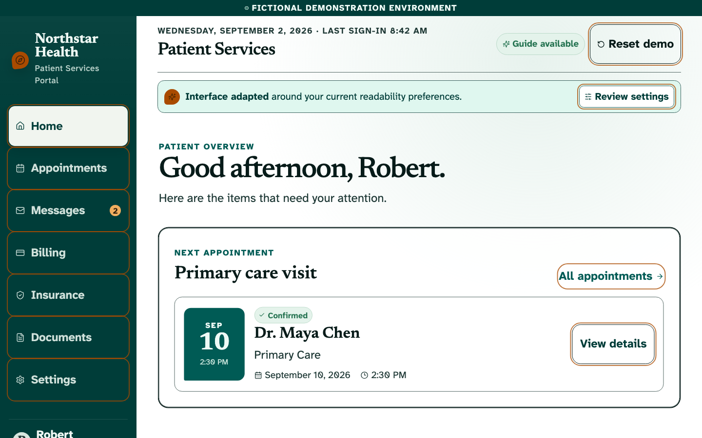
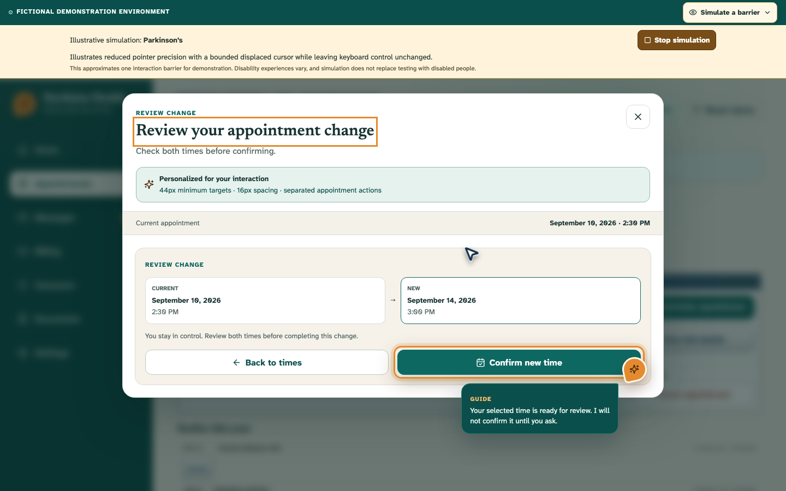

# Guide

**What if websites did not have one fixed interface for everyone?**

Guide is a WebMCP interaction layer embedded in a fictional website. The demo begins with **Northstar Health**, a believable dense institutional patient portal. A person describes what is difficult to see or use to an AI client such as ChatGPT. The client discovers Northstar’s semantic WebMCP capabilities and asks the website to reorganize itself around those functional needs. Guide then stays visibly present to point, explain, collaborate, and complete delegated work.

> Agents should not just use the web for us. They should be able to use it with us.

| Before: one inherited interface | After: adapted around the person |
|---|---|
|  |  |

## Live Demo

- Production: [https://guide-webmcp.vercel.app](https://guide-webmcp.vercel.app)
- Source: [github.com/ikTheProgrammer1/guide-showcase](https://github.com/ikTheProgrammer1/guide-showcase)

Everything in the portal is fictional. There is no healthcare connection, authentication, upload, payment processing, medical advice, or financial advice.

## The Product Thesis

Northstar Health is the website. Guide ✦ is the agent presence inside it.

The initial Northstar interface looks like real institutional software that accumulated features over many years: compact navigation, small type, data tables, abbreviations, weak hierarchy, competing panels, and status indicators led by red and green. It remains usable and semantic—it is not a broken parody.

A single composed tool call can transform the same application:

```ts
configure_accessibility({
  textScale: 175,
  contrast: 'high',
  density: 'simplified',
  controlSize: 'large',
  spacing: 'increased',
  colorIndependentStatus: true,
  emphasizeInteractive: true,
  readAloud: true,
});
```

The result changes hierarchy, content density, navigation, layout, typography, spacing, control size, and status representation. It is structural adaptation, not CSS zoom. Statuses become explicit combinations such as **✓ Active** and **! Payment Due**, so meaning does not rely on color alone.



There are no diagnosis presets. Guide responds to functional needs because people with the same diagnosis can experience the web differently. Manual preferences remain available under **Settings → Accessibility Preferences**; AI is never required for access.

## Collaboration Continuum

| Stage | Person asks | Semantic behavior |
|---|---|---|
| Adapt | “The text is hard to read, red and green look alike, and this is overwhelming.” | Northstar composes several accessibility changes and visibly reflows. |
| Show | “Where do I change my appointment?” | Guide points to a stable semantic target without activating it. |
| Explain | “What does that do?” | Guide highlights the target and explains it in the page. |
| Guide | “Help me reschedule, but let me choose.” | Guide opens a non-committing chooser. |
| Collaborate | The person selects September 14 manually. | The human and agent share one Zustand state. |
| Act | “That works. Finish it.” | Guide re-reads the choice, previews the consequence, and confirms visibly. |

Human input is authoritative. If Guide proposed September 12 and the person selected September 14, a stale confirmation returns `selection_changed` instead of overwriting the person.

## WebMCP Tools

Guide uses the secure-context imperative API, `document.modelContext.registerTool()`. The AI client supplies language understanding and voice input; the website owns adaptation, semantics, shared state, and visible presence.

| Tool | Lifecycle | Behavior |
|---|---|---|
| `get_portal_state` | Always | Reads interface mode, visible section, appointment, workflow, accessibility, revision domains, pending action, and human overrides. |
| `configure_accessibility` | Always | Composes functional settings and visibly transforms Northstar. |
| `guide_to` | Always | Points, highlights, and explains without activation. |
| `open_section` | Always | Opens one of seven semantic portal sections. |
| `get_upcoming_appointments` | Always | Reads the fictional appointment. |
| `get_reschedule_options` | Always | Read-only lookup of the three available slots. |
| `open_reschedule` | Always | Visibly opens the non-committing chooser. |
| `select_reschedule_slot` | Always | Selects a slot only while the chooser is open; never commits it. |
| `get_bill_details` | Always | Returns the fictional $160 / $120 / $40 breakdown. |
| `get_insurance_status` | Always | Returns the fictional active policy. |
| `confirm_reschedule` | Valid slot selected | Validates the shared selection, commits visibly, then unregisters immediately. |

Targets such as `appointments_navigation`, `reschedule_button`, `billing_balance`, and `insurance_status` remain stable even when their DOM elements move between the legacy and adapted layouts. Guide visualizes semantic calls; it does not expose arbitrary selectors, coordinates, mouse movement, or clicks.

## Architecture

```text
Person speaks/types to ChatGPT
            │
            ▼
AI client discovers semantic WebMCP tools
            │
            ▼
Northstar WebMCP layer ──► Guide presence ──► live semantic target
            │
            ▼
Shared Zustand state ◄──────────── human controls
            │
            ├── legacy/adapted portal UI
            ├── review and pending action state
            └── Guide / You attribution and overrides
```

- `src/webmcp/` — schemas, handlers, truthful annotations, and dynamic registration
- `src/presence/` — serialized cursor motion, semantic targeting, cancellation, and speech
- `src/state/` — the shared human/agent state machine and deterministic reset
- `src/components/` — Northstar portal, structural adaptation, preferences, and workflows

Consequential actions capture the relevant revision, animate visibly, then validate state again before committing. Navigation and workflow changes invalidate only the sequences they make stale. The dynamic confirmation tool unregisters immediately after a successful commit, as well as on close, reset, or unmount.

Guide uses three independent monotonic revisions instead of one global interaction counter. `uiRevision` triggers pointer recalculation after reflow, `navigationRevision` detects a changed section, and `rescheduleRevision` protects the selected appointment time. Changing text or contrast therefore never invalidates a valid appointment selection.

`configure_accessibility` accepts a partial patch and preserves every omitted preference. It returns the changed keys, previous and complete resulting configurations, interface mode, UI revision, and two presentation signals. `spokenByPage` reports only whether the optional webpage utterance ended successfully; it does not control or guarantee what the client says.

Webpage read-aloud is an optional SpeechSynthesis fallback, not part of WebMCP. Guide cancels its previous utterance before starting another, waits for speech completion before resolving the tool, and cancels speech after 25 seconds, on reset, on unmount, or when the execution signal aborts.

## Local Development

Requires Node.js 22+ and npm 11+.

```bash
npm install
npm run dev
```

Open `http://127.0.0.1:5173`. Browsers without WebMCP retain the complete manual portal and show an honest preview notice.

The Vercel deployment uses a static SPA fallback, so direct and bookmarked subpaths load the same session-only portal shell instead of returning a hosting 404.

Guide tools require a supported ChatGPT desktop account and model using the built-in browser, or a WebMCP-enabled Chrome environment. For local Chrome testing, enable:

```text
chrome://flags/#enable-webmcp-testing
```

Site Tools availability depends on the current account, selected model, page, and browser permissions. Ordinary Chrome extensions do not automatically provide Site Tools; production Chrome use beyond the built-in browser may require origin-trial enrollment.

## Verification

```bash
npm run check
npm run test:e2e
npm run screenshots
```

Vitest and React Testing Library cover store transitions, attribution, reset, overrides, stale confirmation, schemas, and unsupported-browser behavior. Playwright executes every workflow against the real UI with an injected `document.modelContext` implementation. It verifies dynamic registration, presence, shared state, cancellation, SpeechSynthesis fallback, desktop and 375 px layouts, and no horizontal overflow at 200% text.

The release checklist also includes manual keyboard and VoiceOver verification plus a 20-prompt natural-language Site Tools matrix. The September 3 production gate passed all 20 cases with no consequential call without explicit delegation and no Billing/Insurance hero-flow misroute. See [Accessibility QA](./docs/accessibility-qa.md) and [Tool-selection evaluations](./docs/tool-selection-evals.md).

Axe checks run across the default legacy interface plus simplified, high-contrast, large-control, and 200% text states. The final automated gate passed 22 unit tests and 30 desktop/mobile Playwright cases with no serious or critical axe violations. This is validation evidence, not a claim of WCAG certification.

## Suggested Live Scenario

1. Use **Reset Demo** to restore the dense legacy portal.
2. Ask: “These red and green indicators look the same to me, the text is too small, and this page is overwhelming. Simplify it and read your guidance aloud.”
3. Ask: “I need to change my appointment, but I don’t know how. Show me—don’t change anything yet.”
4. Ask: “What does that do?”
5. Ask: “Help me reschedule, but let me choose the time.”
6. Select **September 14 at 3:00 PM** manually.
7. Ask: “That works. Finish it.”

See [DEMO_SCRIPT.md](./DEMO_SCRIPT.md) for the sub-three-minute narration and shot list.

## Privacy & License

State is frontend-only and session-only. Reload and Reset Demo restore the same fictional legacy state. There is no backend, analytics, persistence, or real patient data.

[MIT](./LICENSE) © 2026 Nicolas Matta
